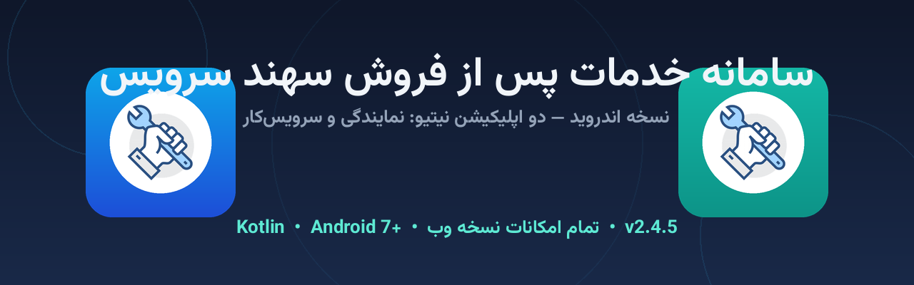

# 📱 سامانه خدمات پس از فروش سهند سرویس — نسخه اندروید

<div align="center">



**دو اپلیکیشن اندروید نیتیو (Kotlin) — پنل نمایندگی و پنل سرویس‌کار**

همان سامانه کامل نسخه وب، روی گوشی — با تمام امکانات، بدون کاهش حتی یک قابلیت

[]()
[]()
[]()
[]()
[]()

**📥 دانلود APK ها:** از بخش [**Releases**](../../releases)

| اپ | فایل | مخصوص |
|---|---|---|
| 🏢 **سهند سرویس \| نمایندگی** | `SahandService-Agency-v2.8.8.apk` | مدیر و کارمندان دفتر نمایندگی |
| 👨‍🔧 **سهند سرویس \| سرویس‌کار** | `SahandService-Technician-v2.8.8.apk` | تکنسین‌های حاضر در میدان |

</div>

---

## 📑 فهرست مطالب

1. [معرفی](#-معرفی)
2. [معماری — چرا این طراحی؟](#-معماری--چرا-این-طراحی)
3. [امکانات کامل](#-امکانات-کامل)
4. [قابلیت‌های نیتیو اختصاصی](#-قابلیت-های-نیتیو-اختصاصی)
5. [پیش‌نیازها](#-پیش-نیازها)
6. [نصب — گام‌به‌گام](#-نصب--گام-به-گام)
7. [راه‌اندازی اولیه (اتصال به سرور)](#-راه-اندازی-اولیه-اتصال-به-سرور)
8. [مجوزهای اندروید و دلیل هرکدام](#-مجوز-های-اندروید-و-دلیل-هرکدام)
9. [امنیت](#-امنیت)
10. [بروزرسانی‌ها — مزیت کلیدی](#-بروزرسانی-ها--مزیت-کلیدی)
11. [ساخت از سورس](#-ساخت-از-سورس)
12. [ساختار پروژه](#-ساختار-پروژه)
13. [امضای دیجیتال (Keystore)](#-امضای-دیجیتال-keystore)
14. [زیرساخت CI/CD](#-زیرساخت-cicd)
15. [تاریخچه نسخه‌ها](#-تاریخچه-نسخه-ها)
16. [رفع اشکال‌های رایج](#-رفع-اشکال-های-رایج)
17. [مجوز (License)](#-مجوز-license)

---

## 📖 معرفی

این ریپازیتوری حاوی **دو اپلیکیشن اندروید نیتیو** سامانه مدیریت نمایندگی خدمات پس از فروش سهند سرویس است:

| | 🏢 اپ نمایندگی | 👨‍🔧 اپ سرویس‌کار |
|---|---|---|
| نام نصب‌شده | سهند سرویس \| نمایندگی | سهند سرویس \| سرویس‌کار |
| شناسه پکیج | `com.sahandservice.app.agency` | `com.sahandservice.app.tech` |
| رنگ برند | آبی آسمانی (#0EA5E9) | سبز-فیروزه‌ای (#14B8A6) |
| کاربران | مدیر دفتر، حسابدار، اپراتور | تکنسین‌های میدانی |
| تمرکز | داشبورد، پذیرش، ارجاع، فاکتور، مالی، انبار، گزارش‌ها، پیامک | سرویس‌های ارجاعی، تغییر وضعیت، قطعات، موقعیت مکانی |

هر دو اپ به **همان سرور پنل** (نسخه cPanel یا VPS سامانه) وصل می‌شوند و کاربر با همان حساب کاربری خود وارد می‌شود. نقش کاربر در صفحه ورود به‌صورت خودکار تشخیص داده می‌شود — سرویس‌کار با شماره موبایل خود و کارمند دفتر با نام کاربری خود وارد می‌شود.

> 🔗 **پیش‌نیاز سرور:** یکی از این دو نسخه باید روی هاست/سرور نصب باشد:
> - نسخه cPanel: [`cPanel_Sahand_Service`](https://github.com/pranses2011/cPanel_Sahand_Service) (توصیه‌شده)
> - نسخه اصلی VPS: `Sahand_Service`

---

## 🏗️ معماری — چرا این طراحی؟

این اپلیکیشن‌ها با رویکرد **«پوسته نیتیو + رابط کامل سامانه»** (Native Shell Architecture) طراحی شده‌اند:

```
┌─────────────────────────────────────────────┐
│              اپلیکیشن اندروید (Kotlin)        │
│                                             │
│  ┌───────────────┐   ┌───────────────────┐  │
│  │  لایه نیتیو    │   │  موتور نمایش وب    │  │
│  │  Splash/Setup  │   │  (WebView + PWA)   │  │
│  │  دانلود فایل   │◄──┤  رابط کاربری کامل   │  │
│  │  آپلود/دوربین  │   │  سامانه سهند سرویس │  │
│  │  موقعیت مکانی  │   │  (همان فرانت‌اند)  │  │
│  │  کوکی/جلسه     │   └─────────┬─────────┘  │
│  └───────────────┘             │ HTTPS      │
└─────────────────────────────────┼───────────┘
                                  ▼
                    🖥️ سرور پنل شما (cPanel/VPS)
                    PHP/MySQL — ۳۲ اندپوینت API
```

**چرا این معماری؟ (تصمیم مهندسی آگاهانه)**

- ✅ **تضمین ۱۰۰٪ برابری امکانات** — رابط کاربری، همان فرانت‌اند جنگی‌شده و تست‌شده نسخه وب است؛ هیچ قابلیتی (از ۳۲ اندپوینت API و ۵۲ جدول) از قلم نمی‌افتد.
- ✅ **بروزرسانی خودکار بدون نیاز به آپدیت اپ** — هر تغییری در پنل سرور، بلافاصله در اپ دیده می‌شود. نیازی به انتشار APK جدید، مرور تأیید مارکت و نصب مجدد نیست.
- ✅ **یک کدبیس، دو پلتفرم** — رفع باگ در رابط کاربری فقط یک‌بار انجام می‌شود و همزمان وب و اندروید را اصلاح می‌کند.
- ✅ **حجم کم و سرعت بالا** — APK نهایی فقط ~۵MB است چون موتور رندر (WebView سیستم اندروید) به‌صورت بومی روی دستگاه وجود دارد.

لایه نیتیو Kotlin تمام چیزهایی را که مرورگر معمولی اندروید ندارد اضافه می‌کند: انتقال فایل به دوربین و گالری، ذخیره امن خروجی‌ها در Downloads، دسترسی GPS برای ثبت موقعیت سرویس‌کار، مدیریت کوکی جلسه، صفحه خطای آفلاین فارسی و…

---

## ✨ امکانات کامل

تمام امکانات نسخه وب در دسترس است — چون همان سامانه است:

### 🏢 در اپ نمایندگی
- **داشبورد آماری** با نمودارهای سرویس ماهانه، درآمد و عملکرد سرویس‌کاران + هشدار موجودی کم
- **تعاریف جامع (۱۷ ماژول):** مشتری (چند شماره)، سرویس‌کار (مدارک/تخصص)، همکار، کارمند، محصول، گروه محصول، برند (۱۱۳ لوگو)، قطعه، گارانتی، طرف‌حساب و…
- **چرخه کامل سرویس:** پذیرش ← ارجاع ← تعویض سرویس‌کار ← اتمام ← فاکتور ← ثبت رضایت
- **مالی کامل:** پرداخت/دریافت، صندوق، بانک، انتقال، هزینه‌ها
- **انبار قطعات:** ورود، خروج، تعدیل، امانی، گردش موجودی
- **دفتر معین ۴گانه** + یادآور + دفترچه تلفن + گروه‌های مشارکت با تسویه خودکار
- **پیامک گروهی و خودکار** (۶ سرویس‌دهنده ایرانی)
- **گزارش‌های نموداری** + خروجی Excel / PDF / JPG / PNG / JSON + چاپ

### 👨‍🔧 در اپ سرویس‌کار
- مشاهده سرویس‌های ارجاعی با جزئیات کامل مشتری و محصول
- تغییر وضعیت سرویس (در حال رفتن، شروع، اتمام و…)
- ثبت قطعات مصرفی و امانی + امضای دیجیتال مشتری روی صفحه لمسی
- 📍 **ثبت موقعیت مکانی با GPS گوشی** (مجوز مکان در اپ فعال است)
- سرویس‌های مشارکتی با تسویه خودکار سهم + چت با نمایندگی + اعلان‌ها

### 🐛 مشترک
- بانک ۲۱٬۰۲۳ خطای لوازم خانگی (۱۱۳ برند) با جستجوی هوشمند
- چت داخلی + اعلان‌ها + ۶ زبان + تقویم شمسی + تم روشن/تاریک

---

## 🧰 قابلیت‌های نیتیو اختصاصی

لایه Kotlin این امکانات را که مرورگر اندروید ندارد فراهم می‌کند:

| قابلیت | شرح |
|---|---|
| 🖼️ **آپلود از دوربین و گالری** | انتخاب فایل در فرم‌های سامانه (آواتار، مدارک، تصاویر سرویس) مستقیم به دوربین گوشی وصل می‌شود |
| 💾 **ذخیره هوشمند خروجی‌ها** | خروجی‌های Excel/PDF/JPG/PNG/JSON (که در WebView معمولی خراب می‌شوند) با هوک اختصاصی JS به **پوشه Downloads** گوشی ذخیره می‌شوند |
| 📍 **GPS سرویس‌کار** | موقعیت مکانی پنل سرویس‌کار با GPS واقعی گوشی کار می‌کند (مجوز runtime + پرسش مجوز خودکار) |
| 🔐 **مدیریت جلسه پایدار** | کوکی جلسه (`sahand_session`) بین اجراها ذخیره می‌شود — ورود فقط یک‌بار لازم است |
| 📶 **صفحه خطای آفلاین فارسی** | قطع اینترنت = صفحه زیبا با دکمه «تلاش دوباره»، نه صفحه سفید |
| 🔙 **دکمه بازگشت هوشمند** | در صفحات داخلی = برگشت؛ در صفحه اصلی = دیالوگ خروج با میان‌بر «تنظیمات سرور» |
| ⬇️ **دانلود فایل‌های پنل** | فایل‌های دانلودی (بکاپ، فاکتور و…) با DownloadManager اندروید + نوتیفیکیشن پیشرفت |
| 🌐 **لینک‌های خارجی** | لینک‌های خارج از سرور (تلفن، ایمیل، واتساپ، سایت‌های دیگر) به اپ مناسب گوشی باز می‌شوند |
| 🖨️ **رابط راست‌چین کامل** | طراحی ۱۰۰٪ RTL با فونت فارسی وزیرمتن (داخل APK) |
| 🚀 **Splash اختصاصی** | صفحه شروع با لوگوی سهند سرویس |

---

## 📋 پیش‌نیازها

| مورد | مقدار |
|---|---|
| **نسخه اندروید** | 7.0 (API 24) به بالا — ~۹۸٪ گوشی‌های فعال |
| **پنل نصب‌شده** | نسخه cPanel یا VPS سامانه سهند سرویس، قابل دسترس از اینترنت |
| **فاصله‌گذاری** | هر دو اپ می‌توانند کنار هم نصب شوند (پکیج‌های جدا) |

---

## 🚀 نصب — گام‌به‌گام

1. **دانلود:** از [Releases](../../releases) فایل APK اپ موردنظر را دانلود کنید (یا از مرورگر گوشی مستقیم دانلود کنید)
2. **اجازه نصب:** هنگام اجرای فایل، اندروید پیام «نصب از منابع ناشناس» می‌دهد ← **تنظیمات** ← اجازه نصب از همین مرورگر/فایل‌منیجر را فعال کنید (اندروید ۸+)
3. **نصب:** دکمه Install را بزنید — چند ثانیه طول می‌کشد
4. **اجرای اول:** آیکون اپ را باز کنید ← راه‌اندازی اولیه (بخش بعد)
5. برای **اپ دوم** همین مراحل را با APK دیگر تکرار کنید

> 💡 هر دو اپ (نمایندگی + سرویس‌کار) می‌توانند همزمان روی یک گوشی نصب شوند — مثلاً برای مدیرِ محل که خودش هم سرویس می‌رود.

### 🔒 درباره هشدار Play Protect
چون این APK از مارکت گوگل نصب نمی‌شود، Play Protect ممکن است هشدار بدهد. این کاملاً طبیعی است — روی **Install anyway / More details ← Install** بزنید. کد منبع کامل در همین ریپو قابل بازبینی است.

---

## ⚙️ راه‌اندازی اولیه (اتصال به سرور)

بار اول که اپ را باز کنید، صفحه **«اتصال به پنل سهند سرویس»** می‌آید:

1. **آدرس پنل** خود را وارد کنید — همان آدرسی که در مرورگر باز می‌کنید؛ مثال: `panel.yourdomain.com` (پیشوند `https://` خودکار اضافه می‌شود)
2. دکمه **«بررسی و اتصال»** را بزنید
3. اپ آدرس را بررسی می‌کند: به `/api` سرور وصل می‌شود و سلامت پنل را تأیید می‌کند، سپس **نسخه پنل** را از `version.json` می‌خواند و نمایش می‌دهد
4. اگر همه‌چیز درست باشد پیام «اتصال برقرار شد» می‌آید و صفحه ورود سامانه باز می‌شود
5. با **حساب کاربری خود** وارد شوید (نقش به‌صورت خودکار تشخیص داده می‌شود)

**تغییر آدرس سرور در آینده:** دکمه بازگشت اندروید ← در دیالوگ خروج روی **«تنظیمات سرور»** بزنید ← آدرس جدید را وارد کنید یا سرور فعلی را حذف کنید.

---

## 🔐 مجوزهای اندروید و دلیل هرکدام

| مجوز | زمان درخواست | دلیل |
|---|---|---|
| `INTERNET` | نصب | اتصال به سرور پنل (بدون این، اپلیکیشنی وجود ندارد!) |
| `ACCESS_NETWORK_STATE` | نصب | تشخیص آنلاین/آفلاین بودن برای صفحه خطا |
| `ACCESS_FINE_LOCATION` + `ACCESS_COARSE_LOCATION` | فقط هنگام استفاده از نقشه/ثبت موقعیت در پنل سرویس‌کار | ارسال موقعیت GPS سرویس‌کار به نمایندگی |
| `WRITE_EXTERNAL_STORAGE` (فقط اندروید ۹ و قدیمی‌تر) | فقط هنگام اولین ذخیره فایل | ذخیره خروجی‌ها در پوشه Downloads (در اندروید ۱۰+ با MediaStore و بدون هیچ مجوزی) |
| دوربین | هنگام انتخاب فایل | گرفتن عکس برای مدارک/آواتار/تصاویر سرویس — از طریق intent سیستمی، بدون مجوز جداگانه |

> 🔒 **بدون مجوزهای مشکوک:** هیچ مجوز مخاطبات، پیامک، میکروفون، تماس یا… درخواست نمی‌شود.

---

## 🛡️ امنیت

- 🔒 **پروتکل امن:** اتصال به سرور همان HTTPS پنل شماست؛ گواهی SSL نامعتبر به‌صورت خودکار **مسدود** می‌شود (پیام فارسی نمایش داده می‌شود)
- 🍪 **جلسه امن:** کوکی جلسه httpOnly بین اپ و سرور — همان مکانیزم نسخه وب، بدون ذخیره رمز عبور روی گوشی
- 🧭 **محدوده دامنه:** لینک‌های خارج از دامنه سرور شما به مرورگر باز می‌شوند و داخل اپ اجرا نمی‌شوند (ضد فیشینگ)
- 🚫 **بدون ردیابی:** اپ هیچ داده‌ای به هیچ سروری جز پنل خودتان نمی‌فرستد؛ هیچ analytics/tracker ندارد
- 🔑 **رمز عبور:** فقط در صفحه ورود سامانه وارد می‌شود و به‌صورت امن توسط سرور (bcrypt) بررسی می‌شود

---

## 🔄 بروزرسانی‌ها — مزیت کلیدی

**اپلیکیشن نیازی به بروزرسانی ندارد!** چون رابط کاربری را از سرور شما می‌گیرد:

| تغییر در پنل | نیاز به APK جدید؟ |
|---|---|
| قابلیت جدید، صفحه جدید، رفع باگ UI | ❌ نه — بعد از رفرش خودکار در اپ دیده می‌شود |
| تغییر سرور/آدرس | ❌ نه — از «تنظیمات سرور» آدرس جدید را بزنید |
| تغییرات عمیق نیتیو (مجوز، دانلود و…) | ✅ بله — نسخه جدید APK از Releases |

تنها زمانی که APK جدید لازم است، تغییر در خود لایه نیتیو باشد؛ در غیر این صورت پنل که بروزرسانی شود، اپ هم همان لحظه جدید است.

---

## 🛠️ ساخت از سورس

### روش ۱ — Android Studio (ساده‌ترین)

1. این ریپو را Clone یا ZIP دانلود کنید
2. در Android Studio: **File ← Open** ← پوشه پروژه را انتخاب کنید (صبر کنید تا Gradle Sync تمام شود)
3. در پنل **Build Variants** (پایین-چپ)، variant موردنظر را انتخاب کنید:
   - `agencyRelease` → اپ نمایندگی
   - `techRelease` → اپ سرویس‌کار
4. **Build ← Build Bundle(s) / APK(s) ← Build APK(s)**
5. خروجی: `app/build/outputs/apk/{flavor}/release/`

### روش ۲ — خط فرمان

```bash
# هر دو اپ:
./gradlew assembleAgencyRelease assembleTechRelease

# فقط اپ نمایندگی:
./gradlew assembleAgencyRelease

# خروجی‌ها:
# app/build/outputs/apk/agency/release/SahandService-Agency-v2.8.8.apk
# app/build/outputs/apk/tech/release/SahandService-Technician-v2.8.8.apk
```

**نیازمندی‌ها:** JDK 17+، Android SDK 34 (خیلی از اینترنت دانلود می‌شود — نیازی به نصب جداگانه نیست)

### پیکربندی سرور پیش‌فرض (اختیاری)

می‌توانید آدرس پنل را داخل اپ hard-code کنید تا کاربر آن را تایپ نکند — در `SetupActivity.kt` مقدار پیش‌فرض `input` را تغییر دهید یا در `MainActivity` مسیر ورود مستقیم بگذارید. (توصیه ما همان حالت پویاست.)

---

## 📁 ساختار پروژه

```
Android_Sahand_Service/
├── app/
│   ├── build.gradle.kts           ← دو flavor: agency + tech + امضای ریلیز
│   └── src/
│       ├── main/                   ← کد مشترک هر دو اپ
│       │   ├── AndroidManifest.xml
│       │   ├── java/com/sahandservice/app/
│       │   │   ├── MainActivity.kt    ← WebView + دانلود + آپلود + GPS + هوک JS
│       │   │   └── SetupActivity.kt   ← صفحه اتصال به سرور + اعتبارسنجی
│       │   ├── res/
│       │   │   ├── layout/            ← activity_main + activity_setup
│       │   │   ├── values/            ← رشته‌های فارسی، تم، رنگ مشترک
│       │   │   ├── font/              ← وزیرمتن (Regular + Bold)
│       │   │   ├── drawable/          ← splash، پس‌زمینه گرادیان
│       │   │   └── xml/file_paths.xml ← FileProvider دوربین
│       │   └── assets/error.html      ← صفحه خطای آفلاین فارسی
│       ├── agency/res/             ← برند نمایندگی: آیکون + رنگ آبی
│       └── tech/res/               ← برند سرویس‌کار: آیکون + رنگ فیروزه‌ای
├── keystore/sahand-release.jks    ← کلید امضا (برای build های بعدی)
├── docs/ci-workflow.yml           ← فایل CI (یک‌بار فعال‌سازی — بخش ۱۴)
├── docs/                          ← بنر و تصاویر README
├── build.gradle.kts               ← AGP 8.5.2 + Kotlin 1.9.24
├── settings.gradle.kts
└── gradle/wrapper/                ← Gradle 8.7
```

**نکته معماری:** دو اپ از یک کدبیس مشترک ساخته می‌شوند (product flavors) — هر باگ‌فیکس همزمان هر دو اپ را اصلاح می‌کند؛ فقط آیکون، رنگ و نام از هم جدا هستند.

---

## 🔑 امضای دیجیتال (Keystore)

APK های ریلیز با `keystore/sahand-release.jks` امضا می‌شوند (اعتبار تا ۲۰۵۶):

| پارامتر | مقدار |
|---|---|
| Alias | `sahand` |
| Store/Key Password | `Sahand@2026` |
| الگوریتم | RSA 2048 |

> ⚠️ **مهم:** امضای یکسان = امکان نصب آپدیت روی نسخه قبلی. اگر keystore را عوض کنید، کاربران باید اپ قبلی را حذف و نسخه جدید را نصب کنند.
>
> 🔒 برای استفاده تجاری خصوصی، توصیه می‌شود keystore خودتان را بسازید: `keytool -genkeypair -v -keystore my.jks -alias myalias -keyalg RSA -keysize 2048 -validity 10950` و مسیر و رمزها را در `app/build.gradle.kts` جایگزین کنید.

---

## 🤖 زیرساخت CI/CD

فایل آمادهٔ CI در مسیر **`docs/ci-workflow.yml`** قرار دارد. پس از فعال‌سازی، روی هر push:

1. هر دو APK ریلیز امضاشده را می‌سازد (`assembleAgencyRelease` + `assembleTechRelease`)
2. APK ها را به‌عنوان **artifact** آپلود می‌کند (قابل دانلود از تب Actions)
3. روی **تگ** (`v*`): به‌صورت خودکار **GitHub Release** می‌سازد و هر دو APK را ضمیمه می‌کند

### فعال‌سازی یک‌باره (۶۰ ثانیه)

به دلایل امنیتی، گیت‌هاب اجازه نمی‌دهد توکن‌های معمولی فایل workflow را push کنند؛ فایل CI کنار سورس ارائه شده و باید یک‌بار فعال شود:

1. در گیت‌هاب روی ریپو → **Add file → Create new file**
2. نام فایل: `.github/workflows/build.yml`
3. محتوای `docs/ci-workflow.yml` را کپی و Commit کنید — تمام!

```bash
# انتشار نسخه جدید (پس از فعال‌سازی CI):
git tag v2.4.6
git push origin v2.4.6
# ← CI خودش ریلیز می‌سازد و APK ها را ضمیمه می‌کند
```

> 💡 بدون CI هم می‌توانید با تگ زدن ریلیز دستی بسازید و APK های build-شده محلی را ضمیمه کنید؛ CI فقط بیلد ابری خودکار است.

---

## 🔐 امنیت شبکه و همگام‌سازی با پنل (B-07)

این اپ یک پوسته (WebView Shell) حول پنل وب است؛ بنابراین **همه قابلیت‌های جدید پنل — چندزبانه ۷ زبانه، مناسبت‌های تقویم، فیلتر تعویض سرویس‌کار، رفع باگ سرویس مشارکتی و فاز صفر امنیتی — بدون به‌روزرسانی APK از طریق همین اپ در دسترس‌اند** (اپ همان پنل زنده را بارگذاری می‌کند).

### تغییرات امنیتی v2.6.1 (همگام با سند تحلیل جامع — بخش B-07)

| مورد | توضیح |
|---|---|
| منع محتوای مخلوط | `MIXED_CONTENT_NEVER_LOAD` — روی سرور https هیچ منبع http بارگذاری نمی‌شود (پیش‌تر COMPATIBILITY بود) |
| هشدار http | ورود آدرس `http://` یک بار هشدار رمزنگاری‌نشده می‌دهد؛ عبور دوم برای سرورهای LAN مجاز است |
| User-Agent هم‌نسخه | `SahandAndroidApp/2.6.1` — قابل شناسایی در لاگ‌های سرور |
| سازگاری با A-02 | کوکی نشست امضاشده از طریق CookieManager استاندارد کار می‌کند — تنها اثر فاز امنیتی: **یک بار لاگین مجدد** |
| health check | `GET /api` و `/version.json` عمومی می‌مانند — صفحه راه‌اندازی بدون تغییر کار می‌کند |

### نقشه راه امنیت (فاز بعدی — نیاز به توسعه نیتیو)

- **Certificate Pinning**: پیاده‌سازی واقعی در WebView نیازمند `shouldInterceptRequest` + اعتبارسنجی دستی گواهی است (حجم کار: متوسط).
- **کلید امضای release**: فایل `keystore/sahand-release.jks` و رمزش **در ریپوی عمومی** است! ⚠️ توصیه: جابه‌جایی به GitHub Secrets و چرخش کلید (با هشدار: کلید جدید یعنی کاربران باید APK را دستی نصب کنند — به‌روزرسانی خودکار قطع می‌شود).
- TLS-only پیش‌فرض پس از مهاجرت همه استقرارهای LAN به https.

---

## 🆕 تاریخچه نسخه‌ها

| نسخه | تاریخ | تغییرات |
|---|---|---|
| **2.6.1** | ۱۴۰۵/۰۶/۱۰ | 🔒 همگام با فاز صفر امنیتی پنل (بخش A سند تحلیل): منع محتوای مخلوط (MIXED_CONTENT_NEVER_LOAD)، هشدار اتصال http رمزنگاری‌نشده، User-Agent هم‌نسخه، هم‌راستایی کامل با پنل v2.6.1 |
| **2.4.5** | ۱۴۰۵/۰۶/۰۹ | 🎉 نخستین انتشار — دو اپ نیتیو (نمایندگی + سرویس‌کار)، راه‌اندازی اتصال به سرور، هوک دانلود blob/data، GPS سرویس‌کار، صفحه خطای آفلاین، فونت وزیرمتن، CI خودکار |

> شماره نسخه اپلیکیشن با شماره نسخه پنل همگام است (2.6.1) تا برابری امکانات مشخص باشد.

---

## ❓ رفع اشکال‌های رایج

| مشکل | راه‌حل |
|---|---|
| «اتصال برقرار نشد» در راه‌اندازی اول | آدرس را با و بدون `https://` امتحان کنید؛ مطمئن شوید پنل در مرورگر گوشی باز می‌شود؛ اگر سرور HTTP است (بدون SSL) از آدرس کامل `http://...` استفاده کنید |
| «پنل سهند سرویس پیدا نشد» | آدرس درست پنل را بزنید (آدرس صفحه ورود سامانه). اپ با فراخوانی `/api` و `version.json` صحت پنل را چک می‌کند |
| خروجی‌های Excel/PDF ذخیره نمی‌شوند | تنظیمات گوشی ← اپ ← مجوزها ← «فایل‌ها و رسانه‌ها/حافظه» را فعال کنید (فقط اندروید ۹ و قدیمی‌تر) |
| موقعیت مکانی کار نمی‌کند | تنظیمات ← اپ ← مجوزها ← موقعیت مکان = «فقط هنگام استفاده از اپ» + GPS گوشی روشن باشد |
| صفحه ورود سبز/سفید می‌ماند | کش مرورگر داخلی: دکمه بازگشت ← تنظیمات سرور ← دوباره اتصال کنید (کش ریست می‌شود) |
| بعد از تغییر آدرس، داده قبلی می‌آید | از «تنظیمات سرور» اول «حذف سرور فعلی» را بزنید، بعد آدرس جدید را وصل کنید |
| نصب با خطای App not installed | نسخه قبلی همان اپ با امضای متفاوت روی گوشی است ← نسخه قبلی را حذف و دوباره نصب کنید |
| Play Protect هشدار می‌دهد | طبیعی است (نصب خارج از مارکت) ← More details ← Install anyway |

---

## 📄 مجوز (License)

```
Proprietary — تمام حقوق برای صاحب پروژه محفوظ است.
هرگونه کپی، بازفروش یا انتشار عمومی بدون اجازه کتبی صاحب پروژه ممنوع است.
فونت وزیرمتن تحت مجوز آزاد SIL OFL 1.1 عرضه شده است.
© سهند سرویس
```

<div align="center">

**🏗️ پروژه‌های هم‌خانواده:**

[🖥️ نسخه cPanel](https://github.com/pranses2011/cPanel_Sahand_Service) — نصب روی هاست اشتراکی (PHP + MySQL)

**⬆️ [بازگشت به بالا](#-فهرست-مطالب)**

</div>
